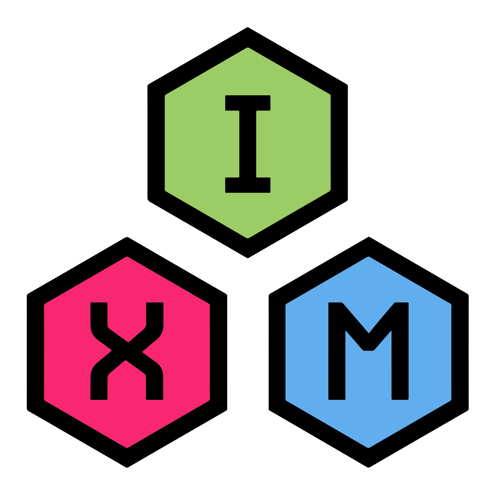

<p align="center">
  
</p>
<h1 align="center">Izzy's eXtension Modules</h1>
<p align="center">
  <a href="LICENSE.md" target="_blank" rel="noopener noreferrer">
    
  </a>
  
</p>

---

# Overview

IXM is a CMake library to help reduce the amount of toil required to perform
common operations within a CMake based project, so they can focus more on
writing their code, and less on managing their CMake.

This means:

 - Reducing the amount of CMake written across multiple projects.
 - Not forcing CDash features onto the rest of us.
 - Setting reasonable defaults found in most CMake projects.
 - A large focus on generator expressions and properties to speed up
   configuration times.
 - Better tooling integration with Protobuf, gRPC, Doxygen, and more!
 - Better GitHub Actions integration.
 - Easier to write `find_package` files.

# Usage

Using IXM is very simple, as you can rely on the `FetchContent` feature
provided by CMake. IXM uses a custom URL to shorten the `FetchContent_Declare`
call.

```cmake
cmake_minimum_required(VERSION 3.31)
include(FetchContent)
FetchContent_Declare(ixm URL https://get.ixm.one)
FetchContent_MakeAvailable(ixm)
```

For more information on using IXM (including *version pinning*), please read
the [documentation](https://ixm.one/guides/installation)!
