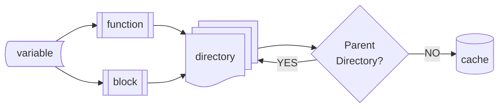
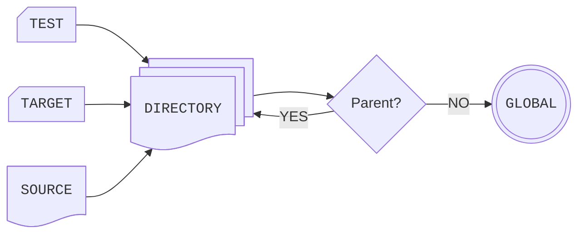

# Writing Scripts

There are few guides out there that will explain the best way to write CMake
scripts *not to solve a problem*, but rather to provide users with a way to
reduce frustration and complexity within their builds.

This section attempts to provide some better understanding of the various
systems at play within CMake and tries to explain how they are tied together.
This should, ostensibly, leave the reader with a better idea of how to read and
use the CMake documentation.

> [!NOTE]
> It is highly recommended that readers be familiar with programming languages
> that use or rely on *prototypal inheritance*. This is the same system used by
> *both* [Javascript's][js] prototype chain, and [Lua's metatable and
> metamethods `__index`][lua], as well as lesser obvious systems such as the
> [Nix scripting language's modules system][nix].

## Type System

It is well known that CMake is entirely "stringly typed". That is, everything
in CMake is a string. While there are other languages that are like this (e.g.,
Tcl), CMake's situation is only *partially* true. While a string is passed
around by the user, there is in fact a very real type system that is
unfortunately inscrutable at the surface level. As such, while variables *are*
storing a string, these strings are *coerced* to specific types under certain
conditions. Sadly, this type system is opaque to users and as a result it is
not possible for custom record types to exist without extreme work happening in
the userspace (i.e., the pure CMake script) side of things.

Ultimately, it is up to CMake to decide whether a given string is valid in a
given context or not. The sections below will discuss each type in detail.

### Booleans

CMake's approach to booleans are a result of ease of use and backwards
compatibility. In addition to the typical `TRUE`/`FALSE` dichotomy of
constants, there are a variety of options available to use for representing
these values. Some of these are intuitive, others are arguably problematic *or*
surprising.

Thankfully, booleans only matter in a few contexts:

 - Any evaluation of strings in calls to `if()` or `while()`.
 - When passed to the `$<BOOL:>` generator expression.

The following table will help to explain *what* is considered a boolean
*constant* in CMake.

> [!WARNING]
> The constants below are *case-insensitive*. This means that `n` is `false`,
> as are `off`, `no`, `ignore`, and more. *This also includes
> spongebob-casing* (`yEs`, `iGnOrE`), for you little gremlins who like to mess
> with people 😡

| Constant | Evaluation |
| :-: | :-: |
| (any non-zero number) | `true` |
| `0` | `false` |
| `ON` | `true` |
| `OFF` | `false` |
| `YES` | `true` |
| `NO` | `false` |
| `TRUE` | `true` |
| `FALSE` | `false` |
| `Y` | `true` |
| `N` | `false` |
| `IGNORE` | `false` |
| `*-NOTFOUND` | `false` |
| `"(any quoted string)"` | `false` |

> [!TIP]
> Remember, an empty string is also an empty list. Thus empty lists are
> implicitly false. However a list with a single `;` is *not* considered empty,
> and thus *will return true*. Behavior regarding lists are discussed in more
> detail [below](#lists).

### Numbers

It might come as a surprise for CMake users that it does in fact support
numbers. That is, it supports integers and floats. Specifically, the `EQUAL`,
and similar binary comparison operators found within the `if()` and `while()`
commands expect to receive a *real number* and specifically mention a C
`double`. In practice, the underlying behavior that CMake relies on is to call
to `sscanf` with a parameter of `%lg`.

> [!NOTE]
> The `math(EXPR)` method does *not* operate on floating point values, and
> instead expects to receive a value that can be parsed with `stoll`.

### Versions

Versions are more or less a special type of number, but because they are not
able to be operated on in the same way an actual number might, CMake has
specific comparison operators *just* for checking versions (e.g.,
`VERSION_GREATER_EQUAL`).

A version is a series of integers, optionally separated by no more than 3 `.`.
While the CMake `VERSION_` binary operators *might* support more than this
series of version components, other parts of CMake *do not* and care must be
taken. Also do note that there are currently no mechanisms within CMake to
support semantic versioning, let alone semantic version notation (such as
`alpha` or `rc`)

### Strings

There is very *little* to say about strings that most CMake users are not
already familiar with. However, it is important to understand that there are 3
types of strings in CMake:

 - quoted
 - unquoted
 - multiline

The third type of string was added in CMake 3.0, and more or less follows the
exact same syntax as found for Lua's multiline string syntax.

```cmake
set(x [=[A matching set of "=" are required on each end of the string.]=])
```

An important aspect of the multiline string is that it does *not* support
variable interpolation as the quoted string type does.

The way users work and operate on strings might make them assume that CMake
uses UTF-8. This becomes clear when using the `string(ASCII)` subcommand to
create binary data values (e.g., ANSI terminal escape values). However, this
might give users a false sense of security. CMake strings are implemented using
the C++ `std::string` type, which does absolutely *no* validation of code
points when they are assigned into a string. In other words, CMake strings are
a *bytestring* that just *happen* to contain legible text. This is most obvious
when we place one of the two byte values that can *never* appear inside of a
UTF-8 string (`C0` and `C1`) inside of a CMake string.

```cmake
string(ASCII 192 invalid)
set(broken-string "This is not a valid UTF-8 byte: ${invalid}")
```

The variable `broken-string` will now always contain an invalid UTF-8 byte.
There is little CMake can do about this, and little users can do to mitigate
this usage.

### Lists

It is almost inevitable that a CMake user has at some point had to deal with
the CMake list type and the incongruencies and surprises this type brings. The
most alarming for many is that CMake lists are just strings whose elements are
separated by a `;`. This makes slightly more sense if you are familiar with the
system `PATH` separator used by Windows, which is also the `;`.

This was further compounded in past years by the lack of commands that provided
ease of use for list manipulation, as well as having to worry about escaping
the `;` when inserting it into a list, as well as the behavior of how CMake
parameters are passed to commands when unquoted *and* the surprising behavior
of expanding lists *in-situ*. This is discussed below in
[References](#references).

Lists are typically created either directly via manipulation of references via
the `list()` command and it's methods, *or* by simply placing spaces between
arguments. For example:

```cmake
set(my-list 1 2 3)
```

This creates a list of 3 elements, and is most akin to the moderately common
syntax of `[1, 2, 3]` in various scripting languages.

### References

References within CMake are when a string represents a value that was at some
point assigned within the various variable scopes. To get the value of a
reference we use the dereference syntax, `${reference-name}`. If you've written
or read CMake code at all, there is an extremely high chance that you've seen
this syntax. If you somehow have managed not to, please contact IXM's author
because you are one in several billion and the author wants to know *how this
happened*.

There are some behaviors regarding references in certain commands that users
should be aware of. The most important is how references operate within calls
to `if()` or `while()`. This is discussed below in
[Dereferencing](#dereferencing).

The second, as alluded to in [Lists](#lists), is the expansion of a reference
when unquoted and passed to a command. Specifically, a list of 0 elements will
expand to nothing at all, a list of one element will be *as if* the list was a
single value variable, and a multi item list will be passed in *as if* they
were inserted into the parameter list *without the automatic list generation of
space separated arguments*.

That is, `command(item ${my-list})` (where `my-list` is the list we created at
the very end of the previous section) is equivalent to the following code:

```cmake
function (command item)
  list(APPEND ARGV 1 2 3)
endfunction()
```

### Paths

The addition of a `cmake_path` command in CMake 3.20 brought with it a new way
to operate on strings intended to be filepaths or directory paths.

### Files

Files are a pseudo-type. We don't ever actually interact with them directly.
Instead we need to pass paths in to the `file()` command and it's methods to
operate on a file. This can become tedious for several reasons:

1. Every `file(WRITE)` or `file(READ)` operation will open and then close the
   file.
2. `file(ARCHIVE)` commands have additional overhead when being operated on.

Obviously, the issue here is *not* that I/O is even taking place, but that we
are opening and closing a file which has large performance implications. This
is mostly an issue on Windows where closing a file takes up a considerable
amount of time due to the filesystem's behavior.

### Directories

It might seem confusing as to why there are path objects *and* directory
objects within CMake. The reason is that a CMake directory is actually "any
directory where a `CMakeLists.txt` file resides. Directory objects exist in a
unique namespace *just* for directories, and they are the primary driving
mechanism for all CMake projects.

> [!WARNING]
> It is absolutely imperative that users reading this guide understand that a
> filesystem directory, a filesystem path, and a CMake directory are all
> absolutely unique and distinct entities. Failure to comprehend this
> distinction will only lead to confusion.

The reason CMake directories exist as an entity is due to backwards
compatibility, as well as how autotools functions. Prior to CMake 2.8, CMake's
true primary approach to declaring and build targets was to rely on directories
for setting properties. It was also common to place one `CMakeLists.txt` file
per directory, much like the `Makefile.am` file used by autotools. This changed
in 2.8 with the introduction of the *target* based build, and has been the main
driving force for CMake ever since.

Directories are created either by being the directory CMake reads it's
`CMAKE_SOURCE_DIR` from, or via `add_subdirectory`. There are *no other ways*
to create a CMake directory scope.

Directories also create their own variable, property, *and* policy scope. This
is discussed in detail in [Scopes](#scopes).

### Commands

Commands are a *namespace* for entities declared with either the `macro()` or
`function()` command. The command namespace is *global*, but can only be
modified or affected by calling the aforementioned builtin commands. Users can
check if a command exists within `if()` or `while()` commands by using the
`COMMAND` unary operator.

Commands are the only "top level" entity that can be used within a script that
are not comments.

Some special commands have explicit keyword arguments as their first parameter.
IXM's documentation calls these "methods", as they are typically used in the
same manner as a method from object-oriented programming languages.

Commands have several advanced concepts that are discussed in detail
[below](#commands-1).

### Targets

It goes without saying that targets are hands down the *most* important entity
in CMake, as without them we could not actually perform the main task CMake
sets out to provide. Like commands and tests, all targets exist in the same
entity *namespace*. That is, nothing can modify targets except commands
intended to operate on targets. At most a user can have a *handle* to a target,
and this handle is merely the *name* of the target (and said name is, as you
might guess, a string).

Targets are unique in that they participate in the prototypal inheritance chain
for properties, and as such they are not truly *global* objects by default.
They are instead associated with the directory they are declared in. However,
names for targets *must* be unique across the entire build. This can cause
confusion for users as you cannot always *modify* a target if it is in a parent
directory or sibling directory.

Target entities are created using `add_library`, `add_executable`, and
`add_custom_target`. Of these, only `add_library` and `add_executable` permit
`ALIAS` targets, which can mimic the naming convention for `IMPORTED` targets
(i.e., they support `::` to exist in their names). This means that, sadly,
custom targets do *not* support complex names.

Targets participate in the same property lookup as tests and directories. See
[Properties](#properties) for more information.

### Tests

Tests, like targets and commands, also have a universal namespace. There is
only *one* way to declare a test, via the `add_test` command. For all intents
and purposes, you can treat a test as a special target that won't affect the
build tree. This does cause issues, however, as the builtin `test` target CMake
provides does *not* build or ensure that a test's executable is available prior
to executing *by default*. This has changed in recent versions of CMake, but it
is important to be aware of.

> [!TIP]
> While users can set custom properties that can then be operated
> on or used within the `CTestTestfile.cmake` file, these properties are *not*
> present in the resulting JSON when executing `ctest --show-only=json-v1`.

## Commands

CMake is what is known as a "command" language. That is, the only valid
"expression" permitted at the top level is a command. Similar languages include
shells such as `sh` and `TCL`, the latter of which was a direct inspiration for
CMake when it was first created in the mid 1990s.

### Functions

Functions are the most common type of command, and work like users might expect
when coming from most scripting languages. Functions create a new *variable
scope*, and are placed within the lines between calls to `function()` and
`endfunction()`.

Functions can be named *any* series of bytes that can be stored within a C++
`std::string`, however only functions whose names match the regex
`[a-zA-Z0-9_]` are able to be called *without* the use of
`cmake_language(CALL)`

```cmake
function(🙂)
  message(STATUS "have a great day!")
endfunction()
# 🙂() -- This is illegal
cmake_language(CALL 🙂) # This is legal
```

### Macros

Macros operate much like CMake functions, however they do *not* create a new
variable scope. Any mutations of variables within a macro will be visible in
its calling scope. Some CMake commands *act* like macros, such as the
`find_package` and `include` commands, both of which will execute *as if* the
files they read were placed inline within their calling scope.

> [!TIP]
> Due to how macros handle variable scoping, they now have a slight performance
> penalty for variables that are set in a given scope. It is recommended that
> *most users* only use `function()` to define commands. IXM does use macros,
> however these are for commands that are already providing heavy lifting and
> who the performance penalty would occur with the use of `function()`
> regardless.

### Keyword Arguments

There are only 3 types of *keyword arguments* in CMake when calling commands.
Whether these arguments are required for the function to operate correctly or
not is irrelevant. They still fall into the following categories:

 - variadic
 - monadic
 - options

Users might be familiar with the concept of a "monad" in programming languages.
This is not the same as the term "monadic" in the context of calling a function
(in any language). Typically, functions in languages that take only one
argument are known as *unary* functions.

Interestingly enough, the `-ary` suffix is of Latin origin, while the `-adic`
suffix comes from Greek. What we sometimes call *n-ary* functions (where `n >=
0`) are also known as *variadic* functions, which is used in a few contexts,
namely the C++ template system, and `va_list` in C (where `va` stands for
*variadic arguments*, though it is typically shortened to the more colloquial
*var args*). Any programming language that can interop with the variadic
arguments for C also technically support variadic arguments.

IXM's documentation uses the `-adic` suffix to describe command arity to stay
consistent, because in the world of CMake few things are.

> [!TIP]
> *Variadic* is a neologism dating back to 1936 - 1937.

#### Variadic

Variadic keyword arguments are those arguments that take zero, one, or more
arguments. In other words, the values passed in vary and the variable can be
treated as a parameter passed to `list()` with little issue.

##### Key Value Pairs

On occasion, a variadic argument might take a series of key-value pairs. We can
see this happen with builtin CMake commands such as `set_target_properties`.
However, CMake does not offer us a way to have this handled on our behalf in a
quick or simple manner.

Thankfully, it is possible to handle these situations. A small code sample is
provided below for at least extracting the keys and values. How these are then
ingested by the user is up to them. If requested, this may be provided in some
manner to users via the IXM public API.

```cmake
if (NOT ${list-variable-name})
  # You will want to skip this part or there will be errors.
endif()
list(LENGTH ${list-variable} length)
# the RANGE method for `foreach` is sadly inclusive of the upper value.
math(EXPR length "${length} - 1")
foreach (begin RANGE 0 ${length} 2)
  list(SUBLIST options ${begin} 2 kv)
  # You can now operate on the key value pair, where
  list(GET kv 0 key)
  # will return the key and
  list(GET kv 1 value)
  # will return the value.
endforeach()
```

#### Monadic

Monadic keyword arguments are those that take exactly *one* argument. If no
arguments are passed to them, they will eat the next string in the sequence,
even if said string is itself a variadic keyword argument.

##### Enumerations

There are a subset of monadic arguments where the value passed to the keyword
argument is one of several valid values. For example, the `file(CONFIGURE)` and
`file(GENERATE)` methods have a `NEWLINE_STYLE` monadic argument. This argument
can only take one of several values, namely `UNIX`, `DOS`, `WIN32`, `LF`, and
`CRLF`. Instances of these keyword arguments are effectively *enums*, and IXM's
documentation will refer to them as such.


#### Options

Options are, thankfully, the simplest to understand. If the keyword argument is
passed in, the option is considered *true*. If it is not passed in, it is
considered false.


## Execution Roles

CMake scripts have 5 well defined (but not well documented) execution "roles".
These are discussed in detail below, however typically the average user only
needs to care about the `PROJECT` role, and in some advanced use cases the
`SCRIPT` role.

### `PROJECT`

The `PROJECT` role is the most familiar for users. This is where *most* users
are writing CMake scripts. Namely, they are executing a `CMakeLists.txt` file
and have access to commands such as `target_link_libraries` and similar.

### `SCRIPT`

Though not used *often*, the `SCRIPT` role has its use in situations where a
third party scripting language (e.g., Python, Perl, Ruby, Javascript, etc.) is
unable to be used or guaranteed to be installed in a given environment.

Thus, users are able to write CMake scripts that can perform a large number of
operations that *most* scripts are needed for.

### `FIND_PACKAGE`

A script might execute under the `FIND_PACKAGE` role if the `--find-package`
flag was passed to CMake. This is *not* recommended. Not only because this
feature is highly undocumented but because the CMake developers themselves have
recommended this not be used, treating it mostly as a legacy feature provided
for backwards compatibility. This feature is honestly half baked, and trying to
execute `find_package` modules under the  `FIND_PACKAGE` results in a wild
number of variables not being defined *at all*.

Not only does IXM recommend you *not* write `find_package` modules to support
the `FIND_PACKAGE` role, it also *refuses* to support it in any context.

### `CTEST`

When a `.cmake` file is executed via the `ctest` executable, the `CMAKE_ROLE`
will return `CTEST`. This is rarely needed by users unless they are manually
generating a `CTestTestfile.cmake` file.

### `CPACK`

The `cpack` executable is typically executed on *either* a `CPackConfig.cmake`
file *or* a `CPackSourceConfig.cmake` file. These are used to perform the final
packaging of a given build tree into an install tree. Users will almost never
need to write these files manually. However, if configuring specific
generators, after the `CPACK_GENERATOR` value is set CPack will automatically
include any files set to `CPACK_PROJECT_CONFIG_FILE`. In these instances, you
can expect the `CMAKE_ROLE` to be `CPACK`

## Scopes

Several entities in CMake create several types of scopes, of which they affect
3 sets of values: policies, variables, and properties. Which entities affect
which values depends. Each of these is discussed below.

### Policies

CMake policies permit projects to rely on backwards compatible behavior without
having to manually upgrade or modify every `CMakeLists.txt` file that is added
to a build. Policy scopes are introduced when a call to `add_subdirectory` is
made, or when the first top level `CMakeLists.txt` file calls
`cmake_minimum_required`. Directories are the only entities affected by CMake
policy scope.

Policies can additionally be modified via the `cmake_policy(SET)` command,
which allows a project to conditionally set policy values explicitly when they
are "opt in" behavior for newer CMake versions.

Additionally, a `block()` can introduce a custom policy scope as well, and the
resulting scope operates much like a directory entity.

Lastly, policies can be set by default via the `CMAKE_POLICY_DEFAULT_CMP<NNNN>`
variables. If a subdirectory does not explicitly call `cmake_policy(SET)` for a
given policy, a parent directory can technically override behavior in this
manner. As a result, policy lookup scope is affected by variable scope, which
is discussed in the next section.

### Variables

Variables might appear to have a lookup scope similar to other dynamic
scripting languages, such as Tcl, Javascript, Lua, Python, and more. However,
while there *are* variable scopes, these scopes only exist for *copying*
references to values within a given scope. The reason for this is due to how
`unset`, and `set(PARENT_SCOPE)` work. For example:

```cmake
function(command)
  unset(ARG_TEST)
  set(ARG_TEST YES PARENT_SCOPE)
  if (ARG_TEST)
    message(STATUS "This will never execute")
  endif()
endfunction()

set(ARG_TEST YES)
command()
```

What has happened here is that, within the function `command`, we've `unset()`
the variable `ARG_TEST` in the local scope, and then we set the value in the
parent scope. However, this only modifies the parent scope, and does not modify
the local scope. Effectively, CMake uses a system where handles for all
variables are copied into the existing scope, but when they are modified (such
as `set()` or `unset()`), it performs a copy-on-write under the hood and thus
doesn't modify the upvalue it came from. This is what leads to surprising
behavior such as calling `set(PARENT_SCOPE)` only to discover that your
variable was also not updated locally.

> [!TIP]
> Historically, CMake has required that setting local and parent variables is a
> 2-step `set()` process for each variable. However, the `return()` command
> recently received a `PROPAGATE` method, permitting users to set variables
> *locally* and then set them in the parent scope in one single command.
> With the example from above, and a slight tweak, we can see this in action:
> ```cmake
> function(command)
>   set(ARG_TEST YES)
>   if (ARG_TEST)
>     message(STATUS "This will always execute")
>   endif()
>   return(PROPAGATE ARG_TEST)
> endfunction()
> set(ARG_TEST NO)
> command()
> if (ARG_TEST)
>   message(STATUS "This will always execute as well")
> endif()
> ```

When performing this underlying "copy" operation, CMake *is* looking at the
variable scopes that are tied directly to the CMake cache, directories,
`function()`s and `block()` entities. Most users are typically operating within
a directory scope.

The (extremely simplified) diagram below explains the lookup chain for
variables, but does *not* define or model the actual copying operations that
CMake is taking under the hood.




### Properties

Property scopes operate in an interesting manner. Properties can be defined
*either* by simply setting them on an entity via the `set_property()` command,
*or* they can be more formally defined via `define_property`. `define_property`
allows users to specify whether a given property participates in a property
scope chain, the documentation associated with said property, and whether there
is a CMake variable to initialize the variable by default.

Property chaining operates much like prototypal inheritance in languages such
as Javascript or Lua. When a property is read via `get_property` (or some
internal CMake operation), it will "chain" to a known parent entity if the
property is not *defined* (as opposed to set) on the given entity.

`DIRECTORY` entities chain to their parent directory scopes, until they reach
the top level directory (the entrypoint `CMakeLists.txt` file). Once they've
chained to this point, they will chain one final time into the `GLOBAL`
property namespace.

`TEST`s, `TARGET`s, and `SOURCE`s will all chain to the `DIRECTORY` they are
defined in (this means that `SOURCE`s do *not* chain to their `TARGET` first,
as one might assume!).

The diagram below should shed some light on how these properties chain between
entities.




## Dereferencing

Some commands (such as `foreach()`, `if()`, and `while()`), will automatically
dereference variables if they are passed in as unquoted strings. This important
to note as this can result in "holes" in conditions arising when they are not
desired.

```cmake
if (CMAKE_SYSTEM_NAME STREQUAL Windows)
  # Do something important here.
endif()
```

In this example, CMake is going to see that `CMAKE_SYSTEM_NAME` is unquoted and
attempt to dereference it. As this is a defined reference, `CMAKE_SYSTEM_NAME`
will dereference to the system that users are currently targeting in their
build. CMake will also see that `Windows` is unquoted and attempt to
dereference this as well. If there *is* no variable named `Windows`, then CMake
will treat it as a string, and code will continue onwards. However, we need to
look at the following case:

```console
$ cmake -Bbuild -DCMAKE_SYSTEM_NAME=Android -DWindows=Android
```

In this instance, the prior example will return `true`, and the `if()` command
will enter it's code block. As this is not ideal, it is important to ensure
that users quote constant values they wish to compare against:

```cmake
if (CMAKE_SYSTEM_NAME STREQUAL "Windows")
  # Do something important here.
endif()
```

> [!NOTE]
> Not *all* conditions will perform auto-dereferences for users. Specifically,
> any condition that checks a *path* (such as `IS_DIRECTORY`, `IS_SYMLINK`,
> etc.) will not auto-dereference unquoted strings. These instead must take
> quoted strings.

## Improving Performance

CMake's configure stage runs in a single threaded context. This can result in
quite a bit of performance loss for larger projects, so it's important to take
the following information to heart.

The largest speed boost users will get is moving behavior from the configure
stage to the generator stage. This can be done via [Generator
Expressions](./generator-expressions), which are explained in detail in the
linked guide.

The second largest speed boost users can get is from reducing the amount of
boolean evaluations found within CMake. While CMake *does* handle pre-parsing
scopes for the `if()` or `while()` commands and only executing them *if* the
command succeeds, the condition evaluator that CMake uses internally has two
glaring issues:

1. It is a Bison/Flex based parser object.
2. It is not re-entrant.

As a result of these, each `if()` or `while()` command creates a new instance
of this parser object, which has quite a bit of overhead due to the constant
translation between native C++ code, and the CMake side of things.

For this reason, it is *highly* recommended that CMake projects use as little
branching as possible, and most definitely avoid nested branching unless
absolutely necessary. Additionally, users should let utility commands (such as
those found in IXM) handle most of the heavy lifting. For example:

```cmake
if (CMAKE_SYSTEM_NAME STREQUAL "Darwin")
  target_link_libraries(my-target PRIVATE Foundation)
endif()
```

This is an unnecessary branch, as a generator expression permits the same
operation, and executes faster.

```cmake
target_link_libraries(my-target
  PRIVATE
    $<$<PLATFORM_ID:Darwin>:Foundation>)
```

As previously stated, more information on improvements like this can be found
in [Generator Expressions](./generator-expressions).

[js]: https://developer.mozilla.org/en-US/docs/Web/JavaScript/Inheritance_and_the_prototype_chain
[lua]: https://www.lua.org/pil/13.4.1.html
[nix]: https://nix.dev/tutorials/module-system/
